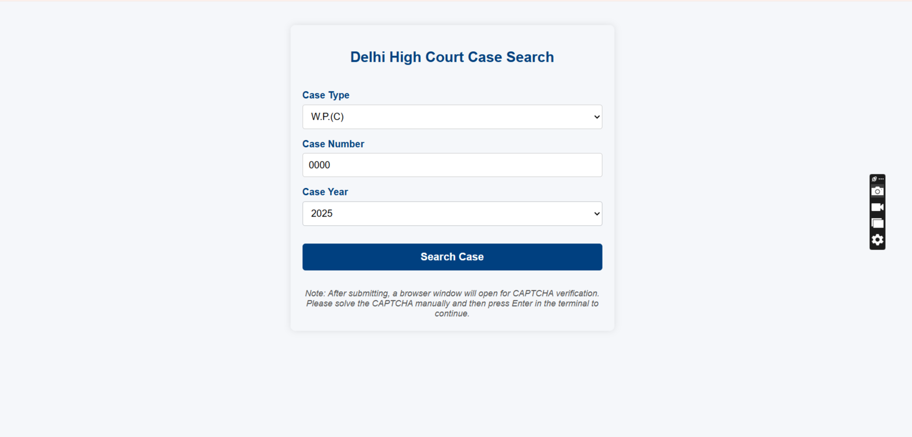
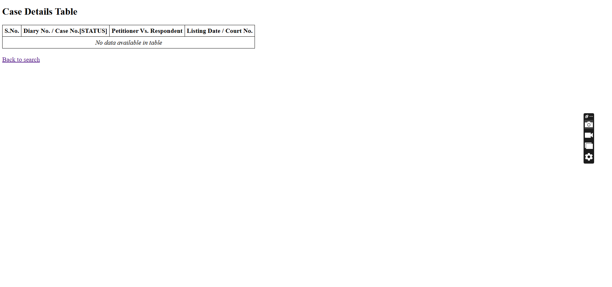
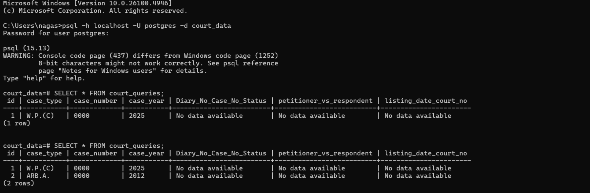

# Court-Data Fetcher & Mini-Dashboard 

## 📌 Why This Project

Most Indian High Court websites, including the Delhi High Court portal, display case details only one case at a time.
for every lookup,the user must enter:
- **case type**
- **case number**
- **case year**
- **captcha**
- read the result
- and repeat the same steps again for the next case

**This becomes inefficient for:**

- **Researchers** tracking multiple cases,
- **Interns** verifying repeated updates,
- **Lawyers** monitoring their case list daily,
- **legal-tech teams** who require structured data and reusuable data.
Each search is temporary,the data disappears once you close the page
  
## 📌 The official website shows the information on the screen but does not provide

- **Data export**
- **Permanent history**
- **Structured  database storage**
- **Comparison between older and newer hearing updates**
- **Bulk access/ automation**
  
➡️Anyone checking the same case tomorrow must repeat the full process again.

## ✔ How This project solves these problem
- **FastAPI workflow** for repeated case lookups
- **Playwright automation** for navigation and form filling
- **manual CAPTCHA solving** (legal and required)
- **structured extraction**of case details
- **permanent storage**in PostgreSQL
- **a clean dashboard** for viewing results

Instead of temporary text on the screen, this project converts court information into **permanent,stored, reusable, analyzable data.**

For implementation , I selected the Delhi High Court website:  
👉 https://delhihighcourt.nic.in/

It is stable, public, structured, and ideal for scraping with Playwright.

---
## 🎥 Demo Video

[Click here to watch the demo video](https://drive.google.com/file/d/12SvDkWtUBWh_dNZ4ZA088Ww8oE1h95rt/view?usp=sharing)

---

## 🚀 What This Project Demonstrates

✔ FastAPI backend development  
✔ Web scraping using Playwright  
✔ Manual CAPTCHA handling (legal and required)  
✔ HTML form-based frontend for case search  
✔ PostgreSQL database integration  
✔ Clean result rendering  
✔ Storing search history  

---

## ⚙️ How the System Works (Simple Flow)

1. User opens the web app at:  
  http://127.0.0.1:8000/form  

2. User fills in the case details (type, number, year).  

3. Playwright launches a browser automatically.  

4. The scraper autofills the official Delhi High Court search form.  

5. Browser waits for the user to solve CAPTCHA manually.  

6. User submits the form on the website.  

7. User presses Enter in the terminal to continue.  

8. Scraper extracts:  
    -  Petitioner vs Respondent 
    - Case status  
    - Next/Last hearing date  

9. Data is:  
   - Shown on the results HTML page  
   - Stored in PostgreSQL  

---

## ⭐ Features

### 🔹 Web Application Features
- Clean HTML form for entering case details  
- Auto-navigation and auto-filling of court form  
- Manual CAPTCHA step → ensures legal scraping  
- Stores:  
  - Search parameters  
  - Extracted case details  
    

### 🔹 Extracted Data Includes
- Petitioner vs Respondent  
- Next hearing date (or last hearing if next is unavailable)  
- Case status  
- Diary number & court info 

### 🔹 Database Storage
Every search entry is saved in PostgreSQL using SQLAlchemy ORM.

---

## 🧠 Technical Stack

Component | Technology  
--------- | ----------  
Backend Framework | FastAPI  
Scraper | Playwright  
Database | PostgreSQL  
ORM | SQLAlchemy  
Templates | Jinja2  
Async Support | async SQLAlchemy + async Playwright  
Frontend | HTML + Jinja templates  

---

## 🛑 CAPTCHA Handling (Important)

CAPTCHA is not bypassed (as that is illegal and violates terms).  
Instead, this system uses:

✔ Playwright browser opens visibly  
✔ User manually enters CAPTCHA  
✔ Scraper continues after confirmation in terminal  

This approach is safe, legal, and recommended.

---

## 📤 Data Extraction Details

The scraper reliably extracts:

- Petitioner/Respondent
- Next Hearing Date (or Last Date)  
- Case Status  
- Diary Number & Listing details  

---

## ⚠️ Limitations (From Court Website Itself)

- Filing Date is not available on search results page  
- Order/Judgment PDF links are not provided  
- To fetch PDFs, deeper scraping into case-detail pages is required  

---

## 🗂️ Database Schema

**Table: court_queries**

Column | Type | Description  
-------|------|-------------  
id | Integer | Primary key  
case_type | String | e.g., W.P.(C), BAIL  
case_number | String | Case number  
case_year | String | Year of filing  
Diary_no_Case_no_status | String | Diary number + case status  
petitioner_vs_respondent | String | Parties involved  
listing_date_court_no | String | Next/Last listing date  

By the way, this table called CourtQuery (or whatever your model name is) is automatically created by the backend using SQLAlchemy. I didn’t manually create this table in PostgreSQL. The ORM creates it for me the first time the project runs. So there is no need to manually create any table — the backend handles everything.

---

## 🛠️ Setup Instructions

### 1️⃣ Clone the repository
```bash
git clone https://github.com/NAGASIVA-JALLA/court-data-fetcher.git  
```
✅ Environment Setup (.env File)
This project uses environment variables to store sensitive information such as the database URL.
For security reasons, the .env file is not included in the GitHub repository.
After cloning the repository, you must manually create a .env file in the project root.
✅ Steps to Create the .env File
#### ➡️ In the project directory, create a new file named:
```bash
 .env
```
#### ➡️ Add the following environment variable inside the .env file:
```bash
DATABASE_URL=postgresql://<username>:<password>@localhost:5432/<database_name>

```

### 2️⃣ Create a virtual environment
```bash
python -m venv venv  
venv\Scripts\activate   # Windows  
source venv/bin/activate  # Mac/Linux  
```

### 3️⃣ Install dependencies
```bash
pip install -r requirements.txt  

```

### 4️⃣ Install Playwright browsers
```bash
playwright install 
```

### 5️⃣ Configure PostgreSQL

```bash
CREATE DATABASE court_data;
```
##### update your .env file:  

```bash

DATABASE_URL=postgresql://<username>:<password>@localhost:5432/<database_name>
```

#### Replace:

➡️ <user_name> → your PostgreSQL username

➡️ <pass_word> → your PostgreSQL password

➡️<database_name> → your PostgreSQL database name


### 6️⃣ Run FastAPI
```bash
uvicorn main:app --reload  

```

### 7️⃣ Open the app
```bash
👉 http://127.0.0.1:8000/form
```
When I run uvicorn main:app, it starts a local server on my computer.
Uvicorn shows a link — this link is the base address of my application.
It means my project is now running at http://127.0.0.1:8000.
To open the form I created, I add /form to the base address.
http://127.0.0.1:8000=http://localhost:8000 (both are same)
So I type:
http://127.0.0.1:8000/form
and that opens the input page from my form.html file.

---

## 🖥️ How to Use

- Enter case type, number, and year  
- Submit the form  
- Playwright opens Delhi High Court website  
- Solve CAPTCHA manually  
- Submit the court form  
- Return to terminal and press Enter  
- View results on the frontend  
- Data is automatically saved in PostgreSQL  

---

## 🚧 Future Improvements

- Automate CAPTCHA if legally permitted  
- Add case-order/judgment PDF scraper  
- Create complete dashboard with charts  
- Add user login system  
- Error reporting + logs page  

---
## 📸 Screenshots

### 📝 Form Page  


### 📄 Result Page  


### 🗄️ Database View  


---

🔒 **Privacy & Ethical Note**  

For privacy and ethical reasons, all screenshots in this README use only dummy case numbers (e.g., W.P.(C) 000 / 2025) and show “No data found”.  

The real scraper does work with actual case numbers and stores the correct extracted data in PostgreSQL, but real court case information is not displayed publicly.

---
🔒 **Legal & Ethical Disclaimer**

This project interacts only with publicly accessible information available on the official Delhi High Court website.
It does not bypass CAPTCHA, authentication, or any security mechanism.
All CAPTCHA entries are solved manually by the user, exactly as required by the official website.

The tool does not attempt to automate, hack, or exploit any restricted pages, APIs, or backend systems of the court.
It only automates the repetitive form-filling and data extraction of information that is already visible to the user in their browser.

This project is intended purely for:
- Educational use
- Learning backend automation
- Understanding FastAPI, Playwright, and PostgreSQL
- Demonstrating structured data extraction for public information

Users must follow all applicable laws and the Terms of Use of the respective government websites.
The developer is not responsible for any misuse of the project.


---

## 🙌 Thank You!
 
👩‍💻 **Developed by:** NAGASIVA JALLA([NAGASIVA JALLA](https://github.com/NAGASIVA-JALLA))
